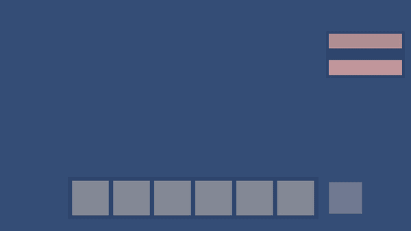
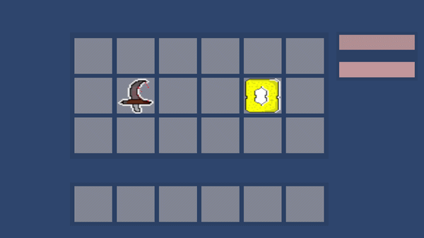

# 🎮 Inventory System (Unity)

## 📌 Overview

This project is a **functional inventory system built in Unity**, focused on the core logic rather than visual design.
It simulates systems commonly found in games, such as item management, drag-and-drop interaction, and stacking mechanics.

The goal of this project was to **apply and strengthen my skills in C# and Unity**, while building something practical and relevant to game development.

---

## 🚀 Live Demo

You can test the project directly in your browser:
👉 https://levidejesus.github.io/Unity-Inventory-System/

---

## 🛠️ Tech Stack

* Unity 2D
* C#
* Aseprite (for item sprites)

---

## ✨ Features

* 🧩 **Drag and Drop System**
  Move items freely between inventory slots.

* 📦 **Item Stacking**
  Combine identical items into stacks.

* 🎒 **Open / Close Inventory**
  Toggle inventory visibility using a button.

* 🎲 **Item Generation**
  Generate items dynamically using UI buttons.

---

## ▶️ How to Run

### Option 1 (Recommended)

* Open the live demo link above
* Interact with the system directly in your browser

### Option 2 (Unity)

1. Clone the repository
2. Open the project in Unity (version **6000.3.10f1 or newer recommended**)
3. Open the main scene
4. Press **Play**

---

## 📁 Project Structure

```
Assets/
├── Art/           # The items
├── Items/         # Item data and definitions
├── Prefabs/       # Reusable game objects
├── Scenes/        # Game scenes
├── Scripts/       # Core logic (inventory system)
├── Settings/      # Project settings
```

---

## 🧠 What I Learned

* How to build a **modular inventory system from scratch**
* Implementing **drag-and-drop mechanics using Unity UI**
* Managing **item data and stacking logic**
* Debugging UI interaction issues (e.g., Canvas Group behavior)
* Structuring a Unity project for better organization

---

## ⚠️ Notes

This project prioritizes **functionality over design**.
The visual/UI aspect is minimal, but the system behind it is fully working and expandable.

---

## 📌 Future Improvements

* Improve UI/UX design
* Add animations and feedback
* Implement save/load system
* Expand item types and behaviors

---

## 📷 Preview





---

## 💬 Final Thoughts

This project represents an important step in my journey as a developer, combining my interest in games with hands-on programming experience in Unity and C#.
